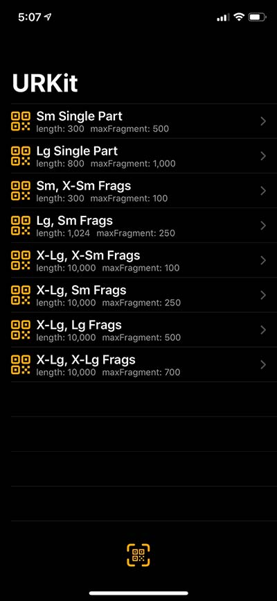
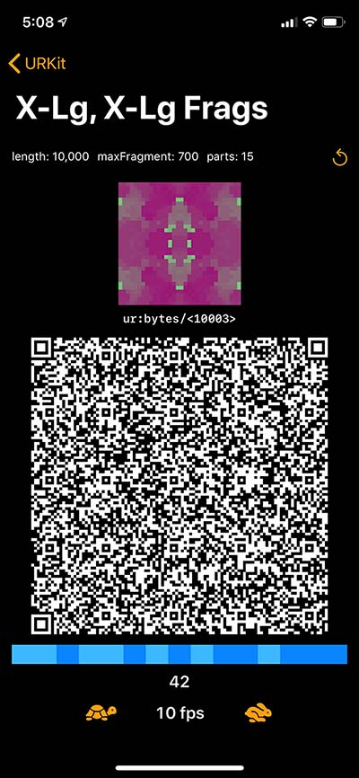
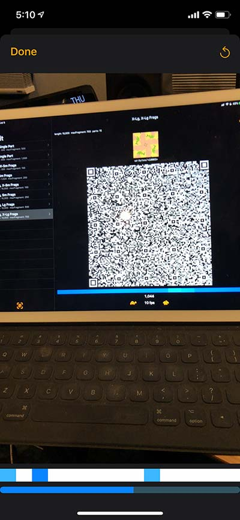
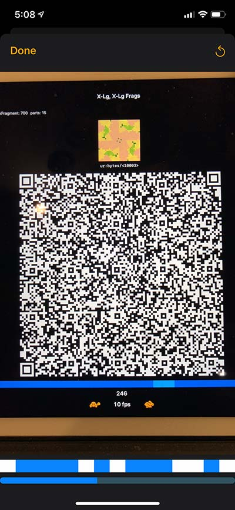
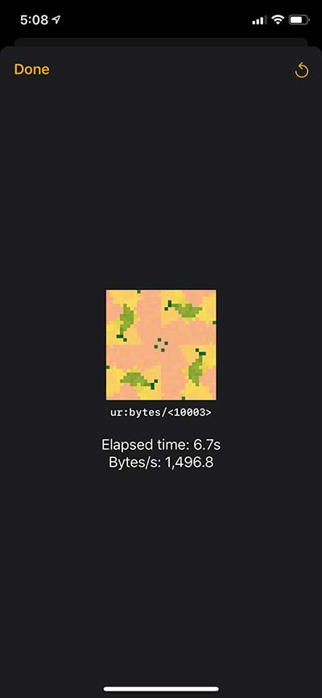

# URDemo
### _by Wolf McNally and Christopher Allen_

**URDemo** is an app to demonstrate sending and receiving of URs using URKit

This app is written in Swift using SwiftUI. It demonstrates the use of [URKit](https://github.com/BlockchainCommons/URKit) to send and receive single-part and multi-part [Uniform Resources (URs)](https://github.com/BlockchainCommons/Research/blob/master/papers/bcr-2020-005-ur.md) via QR codes. Multi-part QR codes are generated using [Luby Transform code](https://en.wikipedia.org/wiki/Luby_transform_code) (fountain codes).

## Additional Information

### Screen Shots

**Main screen.** Either select the scenario for the message you want to send (messages are generated randomly), or tap the button at the bottom to receive a message.

**Sending screen.** A [LifeHash](https://github.com/wolfmcnally/lifehash) displays a hash of the message being sent for easy recognition on the receiving side. The blue bar beneath the animated QR code shows the segments mixed into the currently displayed part. This is part of the fountain codes technique. The buttons below the QR code can be adjusted to show frames at a higher or lower rate.

You can use the circular arrow button in the upper-right to choose a new message and restart the transmission.

**Receiving screen.** You're seeing the sending device through the viewfinder. The blue bar beneath the viewfinder lights up in white to signify the complete parts of the message received so far, and also shows in light blue the fragments mixed in to the last received part. The progress bar at the very bottom shows an estimate of the expected completion percent.

You can use the circular arrow button in the upper-right to abort and restart the current receive, or start a new receive after the last one completes.

**Proper distance and framing.** For optimal transmission, you should try to make the sending QR code fill as much of the viewfinder as possible.

**Acknowledgement screen.** Appears on successfully receiving a message. The LifeHash displayed on the sending and receiving devices should match.

### Video Demo

Explanation of the URDemo iOS application, which demonstrates Blockchain Commons research into transmitting different sizes of UR data, from small single QR codes to large animated fountain codes. 

https://youtu.be/t-GGZ9FyuT8

### Reference Video

Video of Animated QR codes with test reference data for different sizes of UR data, from small single QR codes to large animated fountain codes. 

https://youtu.be/YwgSmOa4ltg

## Status - Late Alpha

**URDemo** is currently under active development and in the late alpha testing phase. It should not be used for production tasks until it has had further testing and auditing.

## Prerequisites

* Swift 5, iOS 13, and Xcode 11.5

## Installation Instructions

* Open `URDemo.xcodeworkspace`, wait for the dependencies to resolve, and build the `URDemo` target for your iOS device.

## Origin, Authors, Copyright & Licenses

Unless otherwise noted (either in this [/README.md](./README.md) or in the file's header comments) the contents of this repository are Copyright © 2020 by Blockchain Commons, LLC, and are [licensed](./LICENSE) under the [spdx:BSD-2-Clause Plus Patent License](https://spdx.org/licenses/BSD-2-Clause-Patent.html).

In most cases, the authors, copyright, and license for each file reside in header comments in the source code. When it does not, we have attempted to attribute it accurately in the table below.

This table below also establishes provenance (repository of origin, permalink, and commit id) for files included from repositories that are outside of this repo. Contributors to these files are listed in the commit history for each repository, first with changes found in the commit history of this repo, then in changes in the commit history of their repo of their origin.

| File      | From                                                         | Commit                                                       | Authors & Copyright (c)                                | License                                                     |
| --------- | ------------------------------------------------------------ | ------------------------------------------------------------ | ------------------------------------------------------ | ----------------------------------------------------------- |

### Dependencies

To build  **URDemo** you'll need to use the following tools:

* Swift 5, iOS 13, and Xcode 11.5

### Derived from…

This  **URDemo** project is either derived from or was inspired by:

* [URKit](https://github.com/BlockchainCommons/URKit) 
* [Uniform Resources (URs)](https://github.com/BlockchainCommons/Research/blob/master/papers/bcr-2020-005-ur.md) 

## Financial Support

**URDemo** is a project of [Blockchain Commons](https://www.blockchaincommons.com/). We are proudly a "not-for-profit" social benefit corporation committed to open source & open development. Our work is funded entirely by donations and collaborative partnerships with people like you. Every contribution will be spent on building open tools, technologies, and techniques that sustain and advance blockchain and internet security infrastructure and promote an open web.

To financially support further development of `$projectname` and other projects, please consider becoming a Patron of Blockchain Commons through ongoing monthly patronage as a [GitHub Sponsor](https://github.com/sponsors/BlockchainCommons). You can also support Blockchain Commons with bitcoins at our [BTCPay Server](https://btcpay.blockchaincommons.com/).

## Contributing

We encourage public contributions through issues and pull requests! Please review [CONTRIBUTING.md](./CONTRIBUTING.md) for details on our development process. All contributions to this repository require a GPG signed [Contributor License Agreement](./CLA.md).

### Discussions

The best place to talk about Blockchain Commons and its projects is in our GitHub Discussions areas.

[**Gordian System Discussions**](https://github.com/BlockchainCommons/Gordian/discussions). For users and developers of the Gordian system, including the Gordian Server, Bitcoin Standup technology, QuickConnect, and the Gordian Wallet. If you want to talk about our linked full-node and wallet technology, suggest new additions to our Bitcoin Standup standards, or discuss the implementation our standalone wallet, the Discussions area of the [main Gordian repo](https://github.com/BlockchainCommons/Gordian) is the place.

[**Wallet Standard Discussions**](https://github.com/BlockchainCommons/AirgappedSigning/discussions). For standards and open-source developers who want to talk about wallet standards, please use the Discussions area of the [Airgapped Signing repo](https://github.com/BlockchainCommons/AirgappedSigning). This is where you can talk about projects like our [LetheKit](https://github.com/BlockchainCommons/bc-lethekit) and command line tools such as [seedtool](https://github.com/BlockchainCommons/bc-seedtool-cli), both of which are intended to testbed wallet technologies, plus the libraries that we've built to support your own deployment of wallet technology such as [bc-bip39](https://github.com/BlockchainCommons/bc-bip39), [bc-slip39](https://github.com/BlockchainCommons/bc-slip39), [bc-shamir](https://github.com/BlockchainCommons/bc-shamir), [Shamir Secret Key Recovery](https://github.com/BlockchainCommons/bc-sskr), [bc-ur](https://github.com/BlockchainCommons/bc-ur), and the [bc-crypto-base](https://github.com/BlockchainCommons/bc-crypto-base). If it's a wallet-focused technology or a more general discussion of wallet standards,discuss it here.

[**Blockchain Commons Discussions**](https://github.com/BlockchainCommons/Community/discussions). For developers, interns, and patrons of Blockchain Commons, please use the discussions area of the [Community repo](https://github.com/BlockchainCommons/Community) to talk about general Blockchain Commons issues, the intern program, or topics other than the [Gordian System](https://github.com/BlockchainCommons/Gordian/discussions) or the [wallet standards](https://github.com/BlockchainCommons/AirgappedSigning/discussions), each of which have their own discussion areas.

### Other Questions & Problems

As an open-source, open-development community, Blockchain Commons does not have the resources to provide direct support of our projects. Please consider the discussions area as a locale where you might get answers to questions. Alternatively, please use this repository's [issues](./issues) feature. Unfortunately, we can not make any promises on response time.

If your company requires support to use our projects, please feel free to contact us directly about options. We may be able to offer you a contract for support from one of our contributors, or we might be able to point you to another entity who can offer the contractual support that you need.

### Credits

The following people directly contributed to this repository. You can add your name here by getting involved. The first step is learning how to contribute from our [CONTRIBUTING.md](./CONTRIBUTING.md) documentation.

| Name              | Role                | Github                                            | Email                                 | GPG Fingerprint                                    |
| ----------------- | ------------------- | ------------------------------------------------- | ------------------------------------- | -------------------------------------------------- |
| Christopher Allen | Principal Architect | [@ChristopherA](https://github.com/ChristopherA) | \<ChristopherA@LifeWithAlacrity.com\> | FDFE 14A5 4ECB 30FC 5D22  74EF F8D3 6C91 3574 05ED |
| Wolf McNally      | Project Lead        | [@WolfMcNally](https://github.com/wolfmcnally)    | \<Wolf@WolfMcNally.com\>              | 9436 52EE 3844 1760 C3DC  3536 4B6C 2FCF 8947 80AE |

## Responsible Disclosure

We want to keep all of our software safe for everyone. If you have discovered a security vulnerability, we appreciate your help in disclosing it to us in a responsible manner. We are unfortunately not able to offer bug bounties at this time.

We do ask that you offer us good faith and use best efforts not to leak information or harm any user, their data, or our developer community. Please give us a reasonable amount of time to fix the issue before you publish it. Do not defraud our users or us in the process of discovery. We promise not to bring legal action against researchers who point out a problem provided they do their best to follow the these guidelines.

### Reporting a Vulnerability

Please report suspected security vulnerabilities in private via email to ChristopherA@BlockchainCommons.com (do not use this email for support). Please do NOT create publicly viewable issues for suspected security vulnerabilities.

The following keys may be used to communicate sensitive information to developers:

| Name              | Fingerprint                                        |
| ----------------- | -------------------------------------------------- |
| Christopher Allen | FDFE 14A5 4ECB 30FC 5D22  74EF F8D3 6C91 3574 05ED |

You can import a key by running the following command with that individual’s fingerprint: `gpg --recv-keys "<fingerprint>"` Ensure that you put quotes around fingerprints that contain spaces.
